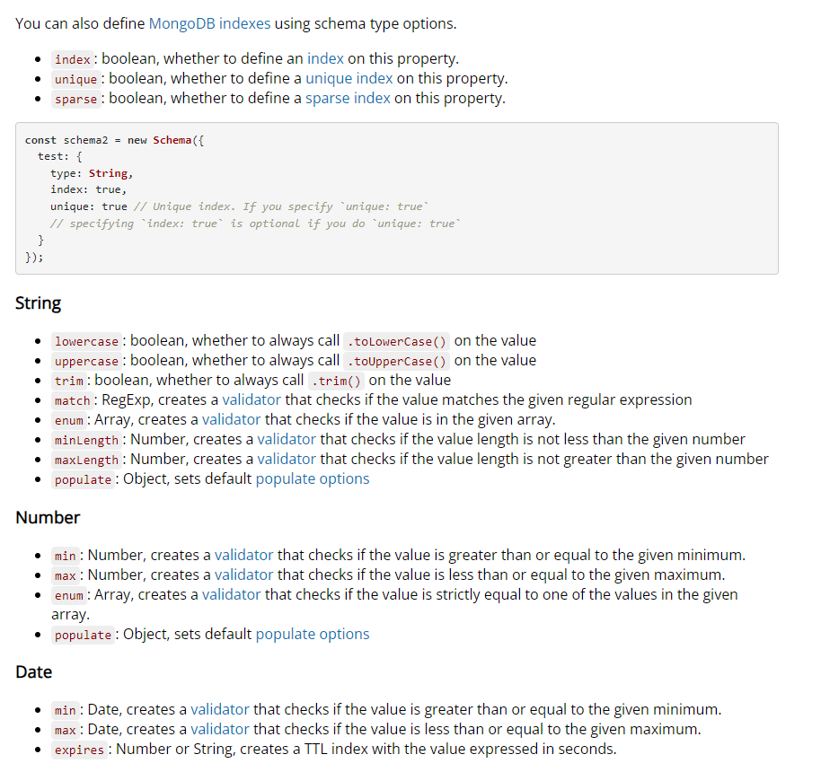

A library that creates a connection between mongodb, node js javascript runtime environment.
It is an ODM (Object Data Modeling) library.

```javascript
mongoose
  .connect("mongodb://127.0.0.1:27017/test")
  .then(() => console.log("Connected to MongoDB"))
  .catch((err) => console.log(err));
```

This line connects to the given database and this connection expects an asynchronous promise from the user.

```javascript
main().catch((err) => console.log(err));
```

## Schema

Schema defines the shape of the documents within that collection.

```javascript
const userSchema = new mongoose.Schema({
  // Define schema fields here
});
```


## Models

A model in mongoose is a class with which we construct documents.

```javascript
const User = mongoose.model("User", userSchema);
```

Here, `User` is the model name and "User" is the collection's name. We generally use the same name for both collection and model.

- User ---> users
- Product ---> products
- Employee ---> employees

This is how collections are created with plural names starting with a small letter.

### Inserting Data Using Mongoose

```javascript
const user1 = new User({ name: "adam", email: "adam@hotmail.com", age: 45 });
const user2 = new User({ name: "jojo", email: "jojo@hotmail.com", age: 32 });
```

At this point, those values are not pushed to the database but are created within the memory of JavaScript.

To check, we can use Node.js:

```sh
node
.load index.js
user1
```

We can see an object with a unique object id.

```javascript
user1.save();
user2.save(); // to save in the database
```

This `save` is an asynchronous function which returns a promise. We can use `.then()` to handle it properly.

### Inserting Many Documents at Once

```javascript
User.insertMany([
  { name: "Tony", email: "nottonystack@gmail.com", age: 43 },
  { name: "peter", email: "notSpiderman@gmail.com", age: 24 },
  { name: "bruce", email: "definitelynotHulk@gmail.com", age: 34 },
])
  .then((res) => console.log(res))
  .catch((err) => console.log(err));
```

### Note: Mongoose Uses Operation Buffering

Mongoose lets you start using your model immediately, without waiting for Mongoose to establish a connection to MongoDB.

# Find Function in Mongoose

Leaving the parentheses empty will return all the documents present in the collection.

```javascript
await User.find({});
```

Find all documents named John and at least age 18.

```javascript
await User.find({ name: "john", age: { $gte: 18 } }).exec();
```

These do not return a promise; they return a Query Object. However, we can use `.then()` after them like this:

```javascript
User.find().then((data) => {
  console.log(data);
});
```

or

```javascript
User.find({ age: { $gte: 47 } }).then((data) => {
  console.log(data);
});
```

Often, a document is searched by its object id, so there exists a specific query only to find a document by id, i.e.,

```javascript
await User.findById(id).then((data) => {
  console.log(data);
});
```

## Update in Mongoose

`updateOne()` updates only the first document that fits the given condition.

```javascript
User.updateOne({ name: "Bruce" }, { age: 49 }) // 1st one is the condition/filter and second one is the updates
  .then((res) => {
    console.log(res);
  });
```

`updateMany()` updates all the documents that fit the given condition.

```javascript
User.updateMany({ age: { $gt: 45 } }, { age: 49 }) //all the documents having age greater than 45 will have age 49
  .then((res) => {
    console.log(res);
  });
```

In the case of `updateOne`, it updates the first document that fits the given condition and returns some metadata such as modified fields and documents, etc.

```javascript
const result = await Model.updateOne(
  { _id: someId }, // Filter criteria
  { $set: { field: "newValue" } } // Update operation
);

console.log(result);
// Output:
// { n: 1, nModified: 1, ok: 1 }
```

But in case of `.findOneAndUpdate()` finds the given document by condition, prints/returns it and then updates it accordingly,

```javascript
const updatedDoc = User.findOneAndUpdate(
  { name: "bruce" }, // Filter criteria
  { $set: { age: 78 } } // Update operation
).then((res) => {
  console.log(res);
});

console.log(updatedDoc);
//the given document is old /before the updation
// Output:
// {
//   _id: new ObjectId('66fc581ad9023d77be8c4242'),
//   name: 'bruce',
//   age: 34,
//   email: 'definitelynotHulk@gmail.com',
//   __v: 0
// }
```

If we want to print/return the updated document, then we have to set the `new` field to `true` like this:

```javascript
const updatedDoc = User.findOneAndUpdate(
  { name: "bruce" }, // Filter criteria
  { age: 78 }, // Update operation
  { new: true } // for returning the updated document
).then((res) => {
  console.log(res);
});

console.log(updatedDoc);

// Output is the updated document
// OUTPUT: {
//   _id: new ObjectId('66fc581ad9023d77be8c4242'),
//   name: 'bruce',
//   age: 78,
//   email: 'definitelynotHulk@gmail.com',
//   __v: 0
// }
```

`.findByIdAndUpdate()` finds a matching document, updates it according to the update argument, passing any options, and returns the found document (if any). It takes `id` as an argument.

```javascript
Model.findByIdAndUpdate(id, { name: "jason bourne" }, options);

// is sent as
Model.findByIdAndUpdate(id, { $set: { name: "jason bourne" } }, options);
```

## Deleting in Mongoose

### `deleteOne()`

`deleteOne()` deletes the first document that matches the given condition.

Example:

```javascript
User.deleteOne({ name: "Bruce" }).then((res) => {
  console.log(res);
});
```

### `deleteMany()`

`deleteMany()` deletes all documents that match the given condition.

Example:

```javascript
User.deleteMany({ name: "jojo" }).then((res) => {
  console.log(res);
});
```

### `findByIdAndDelete()`

The `Model.findByIdAndDelete()` function in Mongoose is used to find a document by its ID and delete it from the database. It works similarly to `findByIdAndRemove()` but is more specific about deletion.

```javascript
User.findByIdAndDelete("615c1f1a2cfa2c4d3f93e8b5", (err, result) => {
  if (err) {
    console.log("Error deleting the document:", err);
  } else {
    console.log("Document deleted:", result);
  }
});
```

### `findOneAndDelete()`

The `Model.findOneAndDelete()` function in Mongoose is used to find the first document that matches the given filter (query) and delete it. It's similar to `findByIdAndDelete()`, but instead of finding a document by its `_id`, it finds it based on the query criteria you specify.

```javascript
User.findOneAndDelete({ name: "John" }, (err, result) => {
  if (err) {
    console.log("Error deleting the document:", err);
  } else {
    console.log("Document deleted:", result);
  }
});
```

## Schema Validation

Basically more rules and constrains for schema
this is used in case of more than one constrains for different document components

```javascript
const bookShcma = mongoose.Schema({
  title: {
    type: String,
    required: true,
  },
  author: {
    type: String,
  },
  price: {
    type: Number,
  },
});
```

We can use default value such as

```javascript
const bookSchema = new mongoose.Schema({
  discount: {
    type: Number,
    default: 0,
  },
});
```

We can use enum to set specific values for the schema
example

```javascript
const bookSchema = new mongoose.Schema({
  category: {
    type: String,
    enum: ["fiction", "Non-fiction"],
  },
});
```

any other value except these will be ignored or cause error on excecution

To store an array of strings for genre use it like this

```javascript
const bookSchema = new mongoose.Schema({
  category: {
    type: String,
    enum: ["fiction", "Non-fiction"],
  },
  genre: ["comics", "superhero", "fiction"],
});
```

We can set immutable schema type (boolean) defines path as immutable.Mongoose prevents you from changing immutable paths unless the parent document has isNew:true



### schema validation on updates

The rules we defined so far only be applied on insertion but not in updation
To apply such rules on to the updation we have to set runValidators to true just like this

```javascript
Book.findByIdAndUpdate(
  "6712c7cb07546b8a250245eb",
  { price: 55 },
  { runValidators: true }
)
  .then((res) => {
    console.log(res);
  })
  .catch((err) => {
    console.log(err);
  });
```

to set custom error message in this process:

```javascript
const bookShcma = mongoose.Schema({
  title: {
    type: String,
    required: true,
  },
  author: {
    type: String,
  },
  price: {
    type: Number,
    min: [1, "Price is too low for amazon selling"],
  },
});
```

to access to erroe for message

```javascript
Book.findByIdAndUpdate(
  "6712c7cb07546b8a250245eb",
  { price: 55 },
  { runValidators: true }
)
  .then((res) => {
    console.log(res);
  })
  .catch((err) => {
    console.log(err.errors.price.properties.message); //to access that message
  });
```
