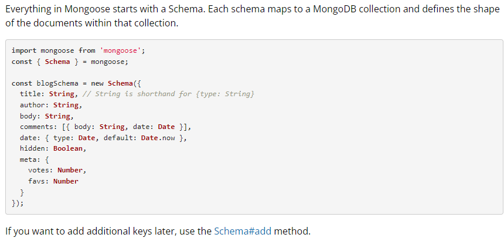

A library that creates a connection between mongodb, node js javascript runtime environment.
It is an ODM (Object Data Modeling) library.

```javascript
mongoose
  .connect("mongodb://127.0.0.1:27017/test")
  .then(() => console.log("Connected to MongoDB"))
  .catch((err) => console.log(err));
```

This line connects to the given database and this connection expects an asynchronous promise from the user.

```javascript
main().catch((err) => console.log(err));
```

## Schema

Schema defines the shape of the documents within that collection.

```javascript
const userSchema = new mongoose.Schema({
  // Define schema fields here
});
```



## Models

A model in mongoose is a class with which we construct documents.

```javascript
const User = mongoose.model("User", userSchema);
```

Here, `User` is the model name and "User" is the collection's name. We generally use the same name for both collection and model.

- User ---> users
- Product ---> products
- Employee ---> employees

This is how collections are created with plural names starting with a small letter.

### Inserting Data Using Mongoose

```javascript
const user1 = new User({ name: "adam", email: "adam@hotmail.com", age: 45 });
const user2 = new User({ name: "jojo", email: "jojo@hotmail.com", age: 32 });
```

At this point, those values are not pushed to the database but are created within the memory of JavaScript.

To check, we can use Node.js:
```sh
node
.load index.js
user1
```
We can see an object with a unique object id.

```javascript
user1.save();
user2.save(); // to save in the database
```

This `save` is an asynchronous function which returns a promise. We can use `.then()` to handle it properly.

### Inserting Many Documents at Once

```javascript
User.insertMany([
  { name: "Tony", email: "nottonystack@gmail.com", age: 43 },
  { name: "peter", email: "notSpiderman@gmail.com", age: 24 },
  { name: "bruce", email: "definitelynotHulk@gmail.com", age: 34 },
])
  .then((res) => console.log(res))
  .catch((err) => console.log(err));
```

## Note: Mongoose Uses Operation Buffering

Mongoose lets you start using your model immediately, without waiting for Mongoose to establish a connection to MongoDB.
