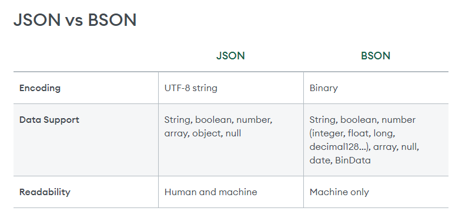

some basic commands for mongodb

# MongoDB Notes

## Basic Commands

1. `mongosh` - Enter Mongo shell
2. `show dbs` - Show all the databases present
3. `use <db_name>` - Use existing or create a new database to use it
4. `db` - Show current database
5. `show collections` - Show collections inside a database

## Basic Info Related to MongoDB

### BSON

- BSON: Binary JSON
  - MongoDB stores data in binary format for more efficiency (only machine-readable data)
  - Document: MongoDB stores data in the form of documents (BSON docs)
  - Collection: MongoDB stores documents in collections

### Disadvantages of JSON

- Text-based
- Space inefficient
- Fewer data types in JSON

---



## SQL Compared to MongoDB

- Instead of tables in MongoDB, we use collections, and each collection holds individual documents which are equivalent to a single row in SQL.

| SQL Term    | MongoDB Term      |
| ----------- | ----------------- |
| Tables      | Collections       |
| Rows/Tuples | Documents (JSONs) |

## Insert in DB

### Create a New Collection

```javascript
db.createCollection("student");
```

### Insert a Single Document

```javascript
db.collection.insertOne();
```

- If a collection does not exist, MongoDB creates the collection when you first store data for the collection.

Example:

```javascript
db.student.insertOne({ name: "adam", marks: 79 });
```

Output:

```json
{
    "acknowledged": true,
    "insertedId": ObjectId('66f1bcb802b373f326c73bf8')
}
```

### Find All Documents

```javascript
db.student.find();
```

Output:

```json
[
    {
        "_id": ObjectId('66f1bcb802b373f326c73bf8'),
        "name": "adam",
        "marks": 79
    }
]
```

### Insert Another Document

```javascript
db.student.insertOne({ name: "bob", city: "delhi", marks: 88 });
```

- You can have as many key-value pairs as you like; there is no specific format.

### Insert Many Documents

```javascript
db.student.insertMany([
  { name: "bob", mark: 68 },
  { name: "gupta", mark: 789 },
]);
```

## Finding Specific Items

### Find by Name

```javascript
db.student.find({ name: "pikul" });
```

- This returns a cursor (an array of documents, references to the actual document).

### Find One by City

```javascript
db.student.findOne({ city: "delhi" });
```

- This returns an actual document.

### Find by Multiple Conditions

```javascript
db.student.find({ city: "delhi", marks: 88 });
```

### Query Examples

- Find students where marks > 75:

  ```javascript
  db.student.find({ marks: { $gt: 75 } });
  ```

- Find students who live in Delhi or Mumbai:

  ```javascript
  db.student.find({ city: { $in: ["delhi", "mumbai"] } });
  ```

- Find students who scored > 75 or live in Delhi:

  ```javascript
  db.student.find({ $or: [{ marks: { $gt: 75 } }, { city: "delhi" }] });
  ```

### Query Operators

| Name | Description                                                         |
| ---- | ------------------------------------------------------------------- |
| $eq  | Matches values that are equal to a specified value.                 |
| $gt  | Matches values that are greater than a specified value.             |
| $gte | Matches values that are greater than or equal to a specified value. |
| $in  | Matches any of the values specified in an array.                    |
| $lt  | Matches values that are less than a specified value.                |
| $lte | Matches values that are less than or equal to a specified value.    |
| $ne  | Matches all values that are not equal to a specified value.         |
| $nin | Matches none of the values specified in an array.                   |

## Logical Operators

| Name | Description                                                                                             |
| ---- | ------------------------------------------------------------------------------------------------------- |
| $and | Joins query clauses with a logical AND returns all documents that match the conditions of both clauses. |
| $not | Inverts the effect of a query predicate and returns documents that do not match the query predicate.    |
| $nor | Joins query clauses with a logical NOR returns all documents that fail to match both clauses.           |
| $or  | Joins query clauses with a logical OR returns all documents that match the conditions of either clause. |

## Element Operators

| Name    | Description                                            |
| ------- | ------------------------------------------------------ |
| $exists | Matches documents that have the specified field.       |
| $type   | Selects documents if a field is of the specified type. |

## Update in DB

### Update One Document

```javascript
db.student.updateOne();
```

- Updates at most a single document that matches a specific filter even though multiple documents may match the specific filter.

```javascript
db.student.updateOne(<filter>, <update>, <options>)
```

Example:

```javascript
db.student.updateOne({ name: "adam" }, { $set: { marks: 99 } });
```

### Aggregation Pipeline Stages

- $addFields
- $set
- $project
- $unset
- $replaceRoot
- $replaceWith

### Update Many Documents

```javascript
db.collection.updateMany();
```

- Updates all documents that match a specific filter.

Example:

```javascript
db.student.updateMany({ city: 99 }, { $set: { city: "delhi" } });
```

### Replace One Document

```javascript
db.collection.replaceOne();
```

- Replaces at most a single document that matches a specific filter even though multiple documents may match the specific filter.

Example:

```javascript
db.student.replaceOne(
  { name: "adam" },
  { $set: { name: "shradha", marks: 99, age: 88 } }
);
```

- This does not change only one field in the document; it changes the whole document itself with the same primary key.
- Adds new fields to documents. `$set` outputs documents that contain all existing fields from the input documents and newly added fields.

## Nesting

Example:

```json
{
    "_id": ObjectId('...'),
    "name": "hari singh",
    "performance": {
        "marks": 99,
        "grade": "a"
    }
}
```

### Create Nested Document

```javascript
db.student.insertOne({
  name: "hari singh",
  performance: { marks: 99, grade: "a" },
});
```

### Find Nested Document

```javascript
db.student.findOne({ "performance.marks": 99 });
```

## Deleting

### Delete One Document

```javascript
db.collection.deleteOne(<filter>, <option>)
```

Example:

```javascript
db.student.deleteOne({ name: "gupta" });
```

### Delete Many Documents

```javascript
db.student.deleteMany({ age: { $eq: 67 } });
```

- For deleting many documents.

### Drop Collection

```javascript
db.student.drop();
```

- Deletes the collection.

### Empty Collection

```javascript
db.student.deleteMany({});
```

- Makes the entire collection empty.

### Drop Database

```javascript
db.dropDatabase();
```

- Deletes the database.
